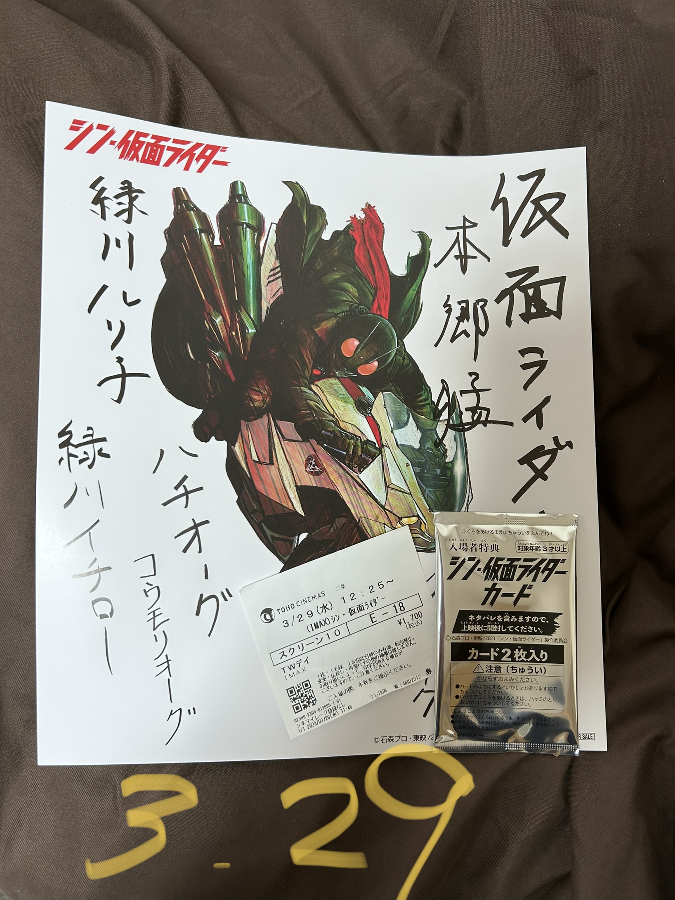

---
tags:
  - action
  - PG12
  - Hideaki Anno
  - movies
  - '2023'
---

# シン・仮面ライダー

{: style="height:350px;width:300px"}

ショッカーと戦うバッターオーグである本郷猛。緑川ルリ子と呼ぶ女の子のために、彼女の兄である一郎との死闘。その前に、クモオーグを殺し、動揺する。ルリ子を見捨てずコウモリオーグを殺す。政府の力で脅威的な毒を持つサソリオーグを排除。ルリ子の知人であるハチオーグを撃破したが殺さなかった。政府の職員が放つサソリの毒の含んだ弾丸でハチオーグが殺された。

洗脳されたバッターオーグ２号と戦う。ルリ子が2号の洗脳を解除。負傷し、ルリ子がカメレオンとカマキリの複合種オーグに致命傷を与えられたのを見せられ、ルリ子と死別。

覚悟した2号と一緒に一郎と戦う。1号は父が、一郎は母が他人・世界の任意的な暴力や悪意により殺された。一郎は世界を変えることに決意、暴力の根源である肉体の無霊化を目指す。1号は人間を肯定する優しさを徹底する。

人生に無駄なことなんて無いと、庵野からの力強いメッセージだった。
